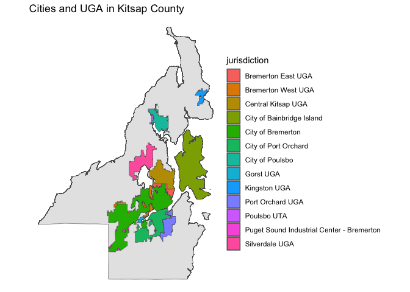
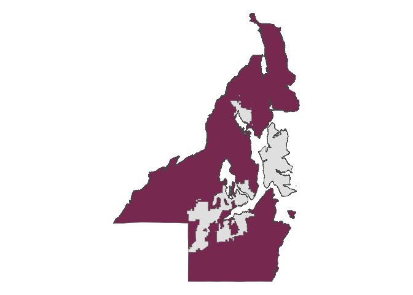

<!-- README.md is generated from README.Rmd. Please edit that file -->

# r4kc

<!-- badges: start -->
<!-- badges: end -->

The goal of r4kc is to simplify reading and using data posted by Kitsap
County in R.

## Installation

You can install the development version of r4kc from
[GitHub](https://github.com/) with:

``` r
# install.packages("devtools")
devtools::install_github("monkeywithacupcake/r4kc")
```

## Example

This is a basic example which shows you how to solve a common problem:

``` r
library(r4kc)
# this will return the three commissioner districts as an sf
commiss <- get_kc_data(get_dataset_name("commission"))
```

You can pull these data down and make a quick map.

``` r
library(tidyverse, quietly)
#> ── Attaching core tidyverse packages ──────────────────────── tidyverse 2.0.0 ──
#> ✔ dplyr     1.1.4     ✔ readr     2.1.5
#> ✔ forcats   1.0.0     ✔ stringr   1.5.1
#> ✔ ggplot2   3.5.1     ✔ tibble    3.2.1
#> ✔ lubridate 1.9.3     ✔ tidyr     1.3.1
#> ✔ purrr     1.0.2     
#> ── Conflicts ────────────────────────────────────────── tidyverse_conflicts() ──
#> ✖ dplyr::filter() masks stats::filter()
#> ✖ dplyr::lag()    masks stats::lag()
#> ℹ Use the conflicted package (<http://conflicted.r-lib.org/>) to force all conflicts to become errors
```

``` r
library(sf)
#> Linking to GEOS 3.11.0, GDAL 3.5.3, PROJ 9.1.0; sf_use_s2() is TRUE
```

``` r
outline <- get_kc_data("Kitsap_County_Outline")
uga <- get_kc_data(get_dataset_name("uga"))
cities_and_uga <- uga %>%
  mutate(type = ifelse(grepl("City ", GMA_JURISDICTION), "City", "UGA")) %>%
  group_by(type, jurisdiction = GMA_JURISDICTION) %>%
  summarize(geometry = st_union(geometry),
            .groups = "drop") %>%
  select(jurisdiction)

ggplot() +
  geom_sf(data = outline) +
  geom_sf(data = cities_and_uga, aes(fill = jurisdiction)) +
  labs(title = "Cities and UGA in Kitsap County") +
  theme_void()
```



You can do more extensive analysis - combining with census or transit or
other kitsap county data. This is especially useful if you want to limit
an analysis to a particular area in Kitsap County, for example.

One quick function is a geometric difference - that handles the
transformation of removing an sf from another and appending a column
with the percent that is remaining. It is called `exclude_cities()`
based on its initial use. It is more generic than excluding cities, and
it may be renamed in future.

``` r
kit_no_cities <- exclude_cities(sf_poly = outline,
                                sf_cities =
                                      filter(cities_and_uga,
                                             grepl("City", jurisdiction)),
                                match_col = 'OBJECTID'
                                      )
#> Warning: attribute variables are assumed to be spatially constant throughout
#> all geometries
```

This doesn’t seem super exciting when we are just throwing together made
up maps, like so:

``` r
ggplot() +
  geom_sf(data = outline) +
  geom_sf(data = kit_no_cities,
          fill = "hotpink4") +
  theme_void()
```



However, it can be useful, and the portion of the remaining geometry can
be passed to further calculations. For example, in this exclusion, the
remaining objects have a mean of 0.7765957 of their initial size (when
they still included cities). Note: this example is meaningless, as the 8
rows making the outline are meaningless.
